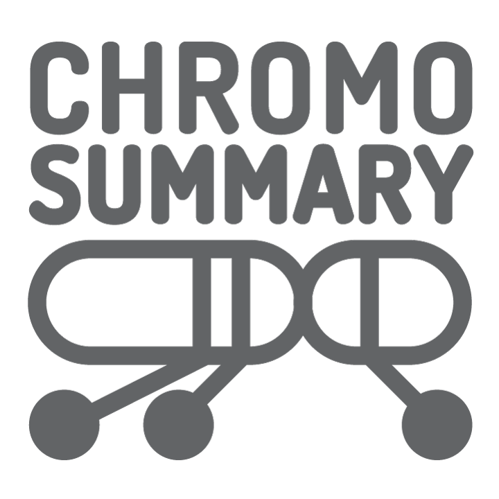

<!-- PROJECT SHIELDS -->
<!--
*** I'm using markdown "reference style" links for readability.
*** Reference links are enclosed in brackets [ ] instead of parentheses ( ).
*** See the bottom of this document for the declaration of the reference variables
*** for contributors-url, forks-url, etc. This is an optional, concise syntax you may use.
*** https://www.markdownguide.org/basic-syntax/#reference-style-links
-->

<!-- PROJECT LOGO -->
 

  

  

    Work in progress. A D3.js visualization tool for chromosome diagrams.
     
    <a href="https://daniloimparato.github.io/chromosummary"><strong>Demo</strong></a>
     
  

<!-- ABOUT THE PROJECT -->
## About The Project

[![Product Name Screen Shot][product-screenshot]](https://daniloimparato.github.io/chromosummary)

Work in progress. A D3.js visualization tool for chromosome diagrams.

### Built With
* [D3.js](https://d3js.org)

<!-- MARKDOWN LINKS & IMAGES -->
<!-- https://www.markdownguide.org/basic-syntax/#reference-style-links -->
[product-screenshot]: screenshot.png